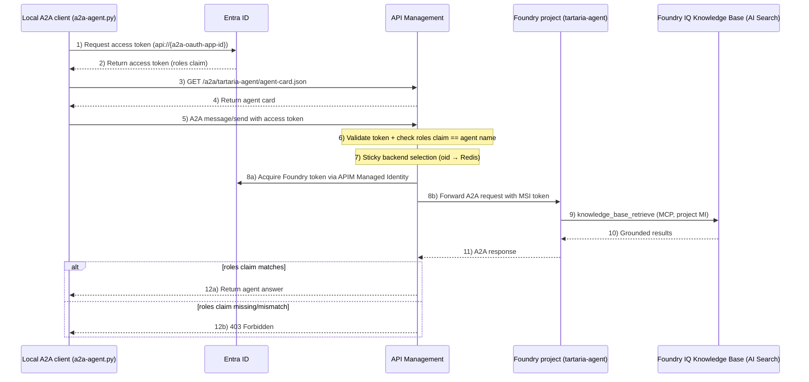
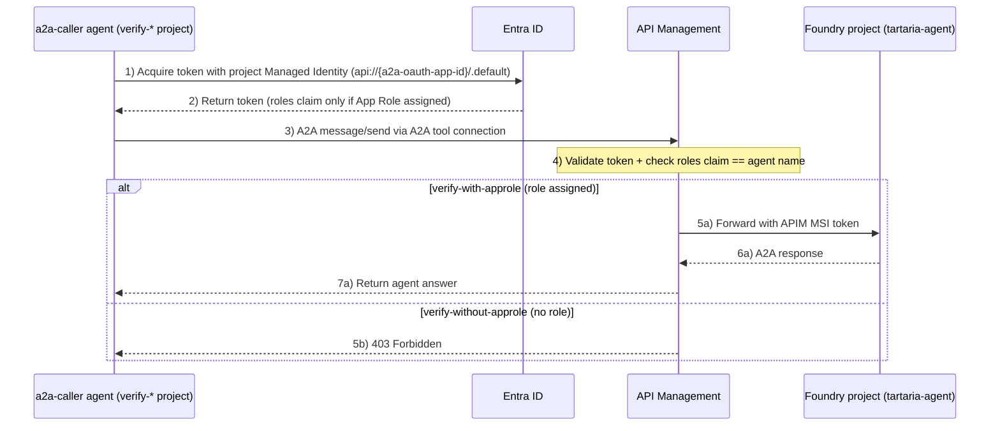

# End-to-End A2A Agent Protection with API Management × Microsoft Foundry

This repository provides a hands-on learning experience for securely exposing and calling a Microsoft Foundry **prompt agent** over the **A2A (Agent2Agent) protocol**, fronted by **Azure API Management (APIM)**.

The whole environment — the `tartaria-agent` prompt agent, the Foundry IQ knowledge base behind it, the APIM `a2a` API / `A2A` product, and the verification projects — is provisioned as IaC with Terraform / `azd up`. See [infra/README.md](infra/README.md) for the IaC details.

## Hands-On Overview

This hands-on lab demonstrates the end-to-end flow for securely calling an A2A agent in two patterns:

- **Local A2A client (`a2a-agent.py`) → APIM → Foundry prompt agent (tartaria-agent)**
- **Foundry agent (`a2a-caller`) → APIM → Foundry prompt agent (tartaria-agent)** — agent-to-agent via the A2A tool

In both patterns, APIM enforces the same product policy: Entra ID token validation, **App Role–based authorization (`roles` claim must match the agent name)**, per-caller sticky load balancing across Foundry backends (Redis external cache), retry/failover, and JSON-RPC error telemetry to Application Insights.

### Pattern 1: Local A2A client → APIM → tartaria-agent

The caller acquires an Entra ID access token for the `a2a-agent` application (audience `api://{a2a-oauth-app-id}`). APIM validates the token and checks that the `roles` claim contains the target agent name (`tartaria-agent`).



### Pattern 2: Foundry agent → APIM → tartaria-agent (A2A tool)

Two verification projects are provisioned in the first Foundry account, each containing an `a2a-caller` prompt agent with an A2A tool connection (`ProjectManagedIdentity` auth) pointing at the APIM endpoint:

| Project                  | App Role on project managed identity | Expected result                           |
| ------------------------ | ------------------------------------ | ----------------------------------------- |
| `verify-with-approle`    | `tartaria-agent` role assigned       | ✅ APIM policy passes, answer is returned |
| `verify-without-approle` | not assigned                         | ❌ APIM policy returns 403                |



## Architecture Features

1. **OAuth2 / Entra ID authorization** — callers (users or managed identities) acquire tokens for the `a2a-agent` application.
2. **App Role–based authorization** — the APIM product policy matches the token `roles` claim against the agent name in the URL (exact or wildcard `prefix-*`).
3. **Sticky load balancing with failover** — per-caller (`oid`) backend assignment persisted in Managed Redis for 24 h; on repeated failures (5xx / 429 / JSON-RPC errors) traffic fails over to another Foundry backend and the sticky assignment is rewritten.
4. **Secretless connections** — APIM reaches Foundry with its system-assigned managed identity; the Foundry project reaches the knowledge base and OpenAI models (via APIM) with project/search managed identities.
5. **Observability** — API diagnostics to Application Insights, plus JSON-RPC errors (which arrive as HTTP 200) pushed to the App Insights `exceptions` table by the policy itself.

## Deploy Hands-On Environment

### Prerequisites

- Terraform (v1.5 or later recommended)
- Azure Developer CLI (`azd`, v1.9 or later recommended)
- Azure CLI (`az`), logged in with `az login`
- An existing **apim-mcp-oauth** deployment ([apc-n-orita/apim-mcp-oauth](https://github.com/apc-n-orita/apim-mcp-oauth)) — this lab adds the A2A configuration to its APIM instance and reuses its Application Insights / Log Analytics Workspace

### Prepare the Hands-On Document

The hands-on requires a sample PDF to be indexed into AI Search.

> **Disclaimer**: Follow the download steps below at your own discretion and responsibility.

**Steps**

1. Open [https://archive.org/details/one-world-tartarians_202304](https://archive.org/details/one-world-tartarians_202304) in your browser.
2. Open the PDF and confirm that around **page 4** it contains the following statement:
   > _"This Book is Open Sourced to Download, Copy and Share / No copyrights reserved"_
3. Click **PDF** under **DOWNLOAD OPTIONS** on the right side of the page to download it.
4. Place the downloaded PDF in `infra/docs/` (any file name).

```bash
mv /path/to/<downloaded-file>.pdf infra/docs/
```

### Deployment Steps

**1. Fill in `infra/main.tfvars.json`**

Set the four existing-resource values to those of your **apim-mcp-oauth** deployment. You can look them up with one command each:

```bash
# Resource group of the apim-mcp-oauth deployment (adjust the env name)
export MCP_RG=$(az group list --tag azd-env-name=<apim-mcp-oauth-env-name> --query '[0].name' -o tsv)

az apim list -g $MCP_RG --query '[0].name' -o tsv                                                                    # -> apim_name
az resource list -g $MCP_RG --resource-type Microsoft.Insights/components --query '[0].name' -o tsv                  # -> application_insights_name
az resource list -g $MCP_RG --resource-type Microsoft.OperationalInsights/workspaces --query '[0].name' -o tsv       # -> log_analytics_workspace_name
```

```jsonc
// infra/main.tfvars.json (excerpt)
{
  "resource_group_name": "<MCP_RG>",
  "apim_name": "<apim name>",
  "application_insights_name": "<application insights name>",
  "log_analytics_workspace_name": "<log analytics workspace name>",
  ...
}
```

**2. Deploy**

```bash
azd up
```

> **Important:** When prompted, select the **same subscription and location as the apim-mcp-oauth deployment**.

All new resources (Foundry accounts/projects, prompt agents, AI Search + knowledge base, storage, Managed Redis, Entra ID `a2a-agent-*` application) are created in the same resource group as the APIM instance.

### Delete Resources

```bash
azd down
```

> The APIM / Application Insights / Log Analytics Workspace are existing resources referenced by `data` sources and are **not** deleted. Note that APIM sub-resources created by this lab (the `tartaria-agent` API, `A2A` product, named values, external cache) are removed.

## Hands-On

### 1. Local A2A client → APIM → tartaria-agent

**1-1. Set up the Python environment**

```bash
python -m venv a2aenv
source a2aenv/bin/activate
pip install a2a-sdk azure-identity httpx requests
```

**1-2. Check your token has the `tartaria-agent` App Role**

The deploying user is assigned the `tartaria-agent` App Role by the IaC. Run `check.entraid_token.py` and verify that `tartaria-agent` is included in the `roles` claim.

```bash
export OAUTH_APP_ID="$(azd env get-value A2A_OAUTH_APP_CLIENT_ID)"
python check.entraid_token.py | grep -v '^===' \
  | jq 'if .roles then (if (.roles | any(. == "tartaria-agent")) then "✅ OK: tartaria-agent is included in roles" else "❌ NG: tartaria-agent not found in roles — run az logout && az login" end) else "⚠️ roles claim is missing — run az logout && az login" end'
```

**1-3. Run the A2A client**

```bash
export A2A_BASE_URL=$(azd env get-value A2A_AGENT_API_URL)
export A2A_AGENT_CARD_PATH="agent-card.json"
export AZURE_TOKEN_SCOPE="api://$(azd env get-value A2A_OAUTH_APP_CLIENT_ID)/.default"

python a2a-agent.py --new
```

Ask something about Tartaria:

```
You: Tell me about the Tartarian Empire theory.
Agent: ...answer grounded on the Foundry IQ knowledge base with source references...
```

Useful options:

- `python a2a-agent.py` — continue the previous conversation (reuses the `context_id` stored in `.a2a_context`; pass `--new` to discard it and start fresh)
- `A2A_DEBUG=1 python a2a-agent.py` — print HTTP status and the `X-Routed-Backend` response header, so you can see which Foundry backend the sticky load balancer selected

### 2. Foundry agents (verify-with-approle / verify-without-approle) → APIM → tartaria-agent

Rough steps — both projects live in the first Foundry account:

```bash
azd env get-value VERIFY_PROJECT_ENDPOINTS
```

1. Open the [Microsoft Foundry portal](https://ai.azure.com) and select the project **`verify-with-approle`**.
2. Open **Agents** → **`a2a-caller`** → playground, and ask a question about Tartaria (e.g., _"Ask the tartaria agent about the Mud Flood theory."_).
   - The A2A tool calls APIM with the **project managed identity**, whose token contains the `tartaria-agent` role → the call passes the APIM policy and the answer comes back.
3. Repeat the same in the project **`verify-without-approle`**.
   - The project MI has **no** App Role → APIM returns `403 Access denied: role does not match agent 'tartaria-agent'` and the tool call fails.

### 3. Inspect the Redis cache (sticky backend assignments)

The APIM product policy stores each caller's backend assignment in Managed Redis (`a2a-backend-oid-{oid}`, TTL 24 h). The deploying user is granted data access via an access policy assignment, so you can inspect it with `redis-cli`:

```bash
export REDIS_HOST=$(azd env get-value REDIS_HOSTNAME)
export OID=$(az ad signed-in-user show --query id -o tsv)
export TOKEN=$(az account get-access-token --resource https://redis.azure.com --query accessToken -o tsv)
```

**Monitor cache operations in real time** (run this in a separate terminal, then send A2A requests):

```bash
redis-cli -h $REDIS_HOST -p 10000 --tls --user "$OID" --pass "$TOKEN" MONITOR
```

**Inspect the stored assignments:**

```bash
redis-cli -h $REDIS_HOST -p 10000 --tls --user "$OID" --pass "$TOKEN"
```

```
> KEYS *
1) "default-workspace_2_a2a-backend-oid-<caller oid>"
> GET "default-workspace_2_a2a-backend-oid-<caller oid>"
"<assigned Foundry account name>"
```

Each key corresponds to one caller (`oid` of a user or a managed identity), and the value is the Foundry backend assigned to that caller. Notes:

- A key appears **only for callers that passed the authorization check** — `verify-without-approle` never gets an entry because it is rejected before the load-balancing step.
- Deleting a key does **not** reshuffle the assignment: it is recomputed deterministically as `MD5(oid) % <number of backends>`.

### 4. Verify failover

The retry/failover condition of the APIM product policy is *no response / 429 / 5xx / JSON-RPC error*. The easiest way to trigger it — and to recover afterwards — is to **delete the chat model deployment on the assigned backend**: the A2A endpoint itself stays reachable (HTTP 200), but the agent run fails on the server side and comes back as a **JSON-RPC error in the response body**, which is exactly the failure pattern this policy is designed to catch.

> This requires two or more Foundry backends (`ai_locations` with 2+ entries).

```bash
export RG=$(azd env get-value AZURE_RESOURCE_GROUP)

# 1. Check the currently assigned backend (e.g., aif-<env>-xxx-001)
redis-cli -h $REDIS_HOST -p 10000 --tls --user "$OID" --pass "$TOKEN" \
  GET "default-workspace_2_a2a-backend-oid-$OID"

# 2. Delete the chat model deployment on the ASSIGNED Foundry account
#    (the deployment name is the chat model name configured in infra/main.tfvars.json)
export CHAT_DEPLOYMENT=$(jq -r '.openai_chat.model_name' infra/main.tfvars.json)
az cognitiveservices account deployment delete \
  -g $RG -n <account name from step 1> --deployment-name $CHAT_DEPLOYMENT

# 3. Send an A2A request in debug mode (X-Routed-Backend header is printed)
A2A_DEBUG=1 python a2a-agent.py
# -> The first request takes ~10 s (4 retries at 2 s interval + failover attempt),
#    then the answer comes back with X-Routed-Backend showing the OTHER account.

# 4. Confirm the sticky assignment was rewritten to the failover target
redis-cli -h $REDIS_HOST -p 10000 --tls --user "$OID" --pass "$TOKEN" \
  GET "default-workspace_2_a2a-backend-oid-$OID"

# 5. Recover — the deleted deployment is managed by Terraform, so azd up recreates it
azd up
```

What to observe:

- **Only the first request after the deletion is slow** (retries + failover). Subsequent requests are fast because the Redis assignment already points at the failover target — this is the sticky-rewrite behavior in action.
- With `MONITOR` running in another terminal, you can see the `SET a2a-backend-oid-...` command issued at the moment of failover.
- The JSON-RPC errors are recorded in the Application Insights `exceptions` table as `JsonRpcError` (with `agentName` / `backend` / `attempt` properties).
