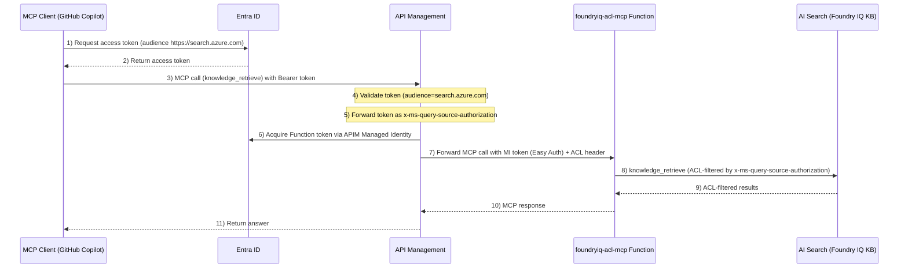
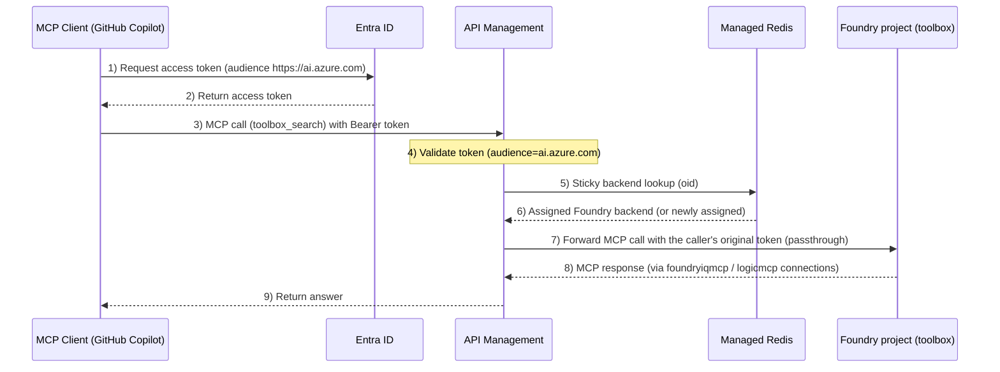

# MCP Hands-On

Hands-on for calling two MCP servers — `foundryiq-acl-mcp` and `toolbox` — through APIM.

## Configure `.mcp.json`

Rewrite both entries in the `.mcp.json` at the repository root with their deployed endpoint URLs in one go:

```bash
jq --arg foundryiq "$(azd env get-value FOUNDRYIQ_ACL_MCP_APIM_URL)" \
   --arg toolbox "$(azd env get-value TOOLBOX_APIM_URL)" \
   '.mcpServers["foundryiq-acl-mcp"].url = $foundryiq | .mcpServers["toolbox"].url = $toolbox' \
   .mcp.json > .mcp.json.tmp && mv .mcp.json.tmp .mcp.json
```

## Foundry IQ MCP (docsacl)

A hands-on for calling `foundryiq-acl-mcp`, a custom Azure Functions–based MCP server that searches an ACL-protected Foundry IQ knowledge base, through APIM.

### Overview

- **Backend**: Azure Functions (Python). Exposes a single tool, `knowledge_retrieve`, which searches a Foundry IQ knowledge base (AI Search) that has ACLs applied.
- **Exposure**: published on APIM as a `type: "mcp"` API (`foundryiq-acl-mcp`). The client-facing MCP endpoint is `<APIM gateway>/foundryiq-acl-mcp/runtime/webhooks/mcp`.
- **Authorization audience**: `https://search.azure.com/`
- **How ACL works**: the caller's (agent/client) `search.azure.com`-scoped token is forwarded as-is to the backend in the `x-ms-query-source-authorization` header. AI Search uses the contents of this header to return only the documents the calling user is authorized to see. In other words, this token doubles as both the "authorization to call the MCP tool" and the "user identity for ACL evaluation."
- **Backend Function protection**: the Function itself is protected by Easy Auth (audience `api://{oauth-app-id}/`), satisfied by a token acquired by APIM's system-assigned managed identity.



### Hands-On

With `.mcp.json` configured (see [Configure `.mcp.json`](#configure-mcpjson) above), connect from an MCP-capable client such as GitHub Copilot (the token is fetched dynamically on every call via the entry's `headersHelper`), ask a question about Tartaria via the `knowledge_retrieve` tool, and confirm you get back an answer with source references.

## Toolbox

A hands-on for calling `toolbox`, a Microsoft Foundry **Toolbox** — an MCP endpoint that bundles multiple tool connections (`foundryiqmcp`, `logicmcp`) behind a single MCP server — through APIM.

### Overview

- **Backend**: a Foundry Toolbox (`toolbox/toolbox.yaml`), which bundles the `foundryiqmcp` and `logicmcp` project connections into a single `toolbox_search` tool. The Toolbox itself is not an ARM resource; it's created with the `azd ai toolbox` CLI against a Foundry project.
- **Exposure**: published on APIM as a `type: "mcp"` API (`toolbox`), load balanced across multiple Foundry backends with per-caller (`oid`) sticky routing (same pattern as the [a2a hands-on](../a2a/README.md#3-inspect-the-redis-cache-sticky-backend-assignments)) and retry/failover. The client-facing MCP endpoint is `<APIM gateway>/toolbox/api/projects/toolbox-project/toolboxes/toolbox/mcp?api-version=v1` — note the required `?api-version=v1` query string.
- **Authorization audience**: `https://ai.azure.com/`
- **Backend authentication**: unlike the a2a and foundryiq-acl-mcp policies, the caller's own token is passed through to the Foundry backend unchanged (not swapped for APIM's managed identity token). This is required so that the `foundryiqmcp` connection's On-Behalf-Of (OBO) exchange sees the actual calling user's token.



### Create/publish the Toolbox

The Toolbox itself is created separately from the Terraform deployment. `TOOLBOX_PROJECT_ENDPOINTS` is a map with one `toolbox-project` endpoint per Foundry backend, so loop over all of them:

```bash
azd env get-value TOOLBOX_PROJECT_ENDPOINTS | jq -r '.[]' | while read -r endpoint; do
  azd ai project set "$endpoint"
  azd ai toolbox create toolbox --from-file toolbox/toolbox.yaml
done
```

If you change the connections in `toolbox/toolbox.yaml` later, re-run the same loop to recreate the Toolbox on every project.

### Hands-On

With `.mcp.json` configured (see [Configure `.mcp.json`](#configure-mcpjson) above), connect from an MCP-capable client such as GitHub Copilot (the token is fetched dynamically on every call via the entry's `headersHelper`), call the `toolbox_search` tool, and confirm it routes to the tools bundled by the Toolbox (`foundryiqmcp`, `logicmcp`).

## Next

Continue to [Technical Details](tech.md) — authorization design trade-offs, load balancing, and the `foundryiq-acl-mcp` implementation notes.
